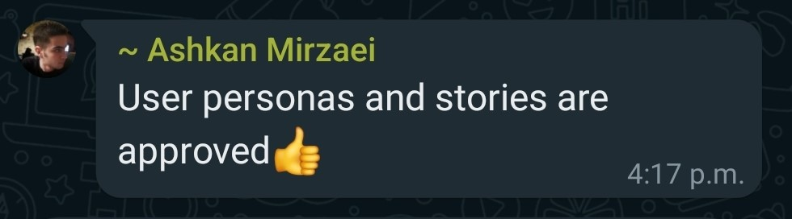
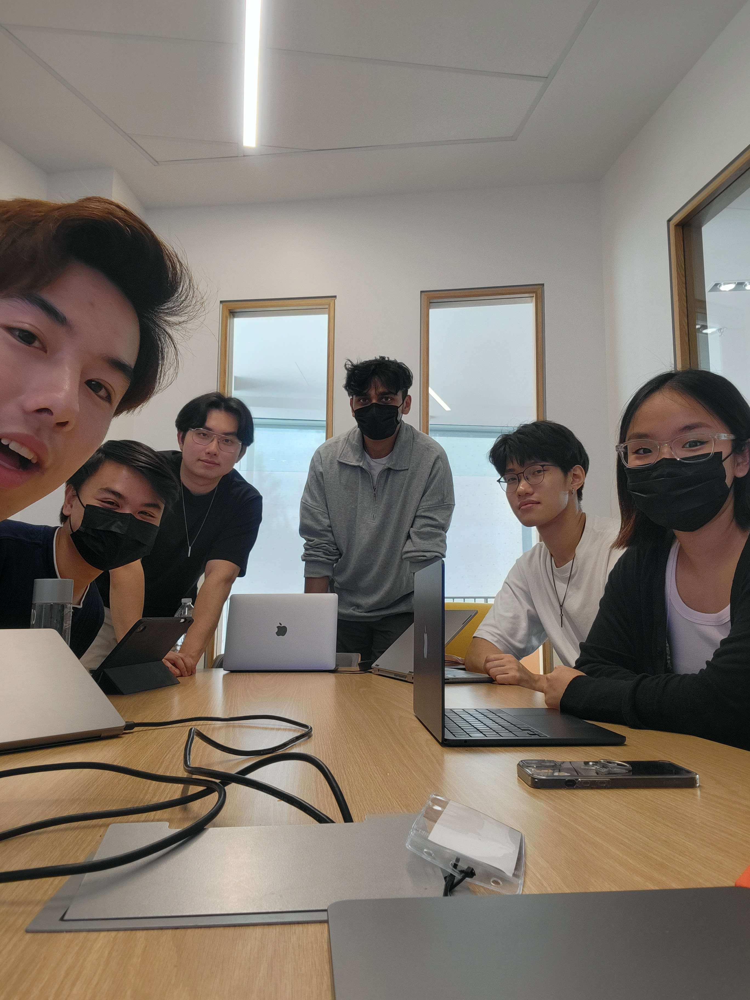

# articulat3 - Team Corndogs
<!-- >_Note:_ This document will evolve throughout your project. You commit regularly to this file while working on the project (especially edits/additions/deletions to the _Highlights_ section). 
 > **This document will serve as a master plan between your team, your partner and your TA.** -->

- [Product Details](#product-details)
    - [Q1: What is the product?](#q1-what-is-the-product)
    - [Q2: Who are your target users?](#q2-who-are-your-target-users)
    - [Q3: Why would your users choose your product? What are they using today to solve their problem/need?](#q3-why-would-your-users-choose-your-product-what-are-they-using-today-to-solve-their-problemneed)
    - [Q4: What are the user stories that make up the Minumum Viable Product (MVP)?](#q4-what-are-the-user-stories-that-make-up-the-minumum-viable-product-mvp)
    - [Q5: Have you decided on how you will build it? Share what you know now or tell us the options you are considering.](#q5-have-you-decided-on-how-you-will-build-it-share-what-you-know-now-or-tell-us-the-options-you-are-considering)
- [Intellectual Property Confidentiality Agreement](#intellectual-property-confidentiality-agreement)
- [Teamwork Details](#teamwork-details)
    - [Q6: Have you met with your team?](#q6-have-you-met-with-your-team)
    - [Q7: What are the roles & responsibilities on the team?](#q7-what-are-the-roles--responsibilities-on-the-team)
    - [Q8: How will you work as a team?](#q8-how-will-you-work-as-a-team)
    - [Q9: How will you organize your team?](#q9-how-will-you-organize-your-team)
    - [Q10: What are the rules regarding how your team works?](#q10-what-are-the-rules-regarding-how-your-team-works)

## Product Details
 
### Q1: What is the product?

  

The product we’ll be creating is a user-friendly web application for 3D content creation from user-given text prompts. Users will also be able to view existing 3D creations for inspiration and creative usage. 

 Our partner, Toronto Intelligent Systems Lab (TISL), enables robust interactive autonomy in robotics. Their research involves Robotics, Computer Vision, and Machine Learning[^1]. Their goal with this specific project is to make 3D generation as simple and accessible as possible. 

#### The problem at hand

Users need 3D objects for content creation (ie. video games, social media, animations, 3D printing), but have difficulty learning existing modeling software. Generating unique and custom 3D objects should be a frictionless experience. It would also be helpful for users to view other 3D creations for further inspiration and usage in their own products. 

#### What our product can do

When entering the site, users will see a clear call-to-action to generate new 3D content. An input text box first prompts them to describe an object. The site then chooses the best model to create the object. At the time of writing, the following models are provided by the threestudio[^2] project: Score Jacobian Chaining, DreamFusion, TextMesh, Latent-NeRF, and Fantasia3D. The web app will then use the exposed Gradio API from threestudio to generate the 3D object and prepare for export.

Furthermore, the home page will feature an updating gallery with image thumbnails of previously generated objects. When a thumbnail is clicked, the user can interact with the 3D object using their mouse, with support for object revolution. The gallery will be searchable using the prompts associated with the objects (note that these prompts don’t need to be unique). The user can then download all files associated with an object. In particular, our product will support downloads of the thumbnail (.png), surface material (.mtl), geometry definition (.obj), and textures (.jpg). 

##### [**👉 View our low-fidelity prototype on Figma!**](https://www.figma.com/file/PiuZtndJxjyLuyAER2jeSh/Website-Prototype?type=design&node-id=0%3A1&mode=design&t=A9eFYF6kFeUOTlsQ-1)

[^1]:https://tisl.cs.toronto.edu/ 
[^2]:https://github.com/threestudio-project/threestudio

### Q2: Who are your target users?

Our main target users are content creators, game designers, hardware creators, and animators. In general, the web app welcomes individuals who are interested in using, creating, or simply browsing 3D content and generation.

##### [**👉 View the user personas**](https://workspace68739247.xtensio.com/folder/82zhkpai)

### Q3: Why would your users choose your product? What are they using today to solve their problem/need?

Our users would choose our product for the following reasons:

1. A video game designer wants to create 3D video game assets quickly. They can brainstorm ideas quickly by writing in the text box. The product can then produce a design in 5-15 minutes, but the modeling stage in softwares like 3ds Max or Maya (no textures) can take a few days for a 3D modeler[^3].
1. A user working on creating a digital video (ie. movie, Youtube video) wants to prototype 3D designs to use in their content, but doesn’t want to go through the process of learning how to 3D design from scratch. A more experienced designer may want to create a 2D sketch, but in roughly the same amount of time they can generate something in 3D using our product.
1. Purchasing large amounts of 3D assets can be expensive, but our product is a free and easy-to-use way to produce accessible assets in various styles.
1. Users can generate assets easily using a simple UI.

Existing competitor solutions (such as those from [lumalabs.ai](http://lumalabs.ai) or [3dfy.ai](http://3dfy.ai/)) do not present 3D product and mockup generation intuitively. They are cluttered with options and UI elements that take away from a simple experience. Furthermore, competitors lack options to change the model used, which can result in unvarying results. They also prompt the user to login immediately which takes away from its convenience. 

The current threestudio program involves cloning, building, installing dependencies, CUDA, and obtaining an NVIDIA graphics card with at least 6GB or 20GB VRAM (depending on the model), before any object is generated. These inconveniences are motivations for our solution: a simple and accessible tool for 3D content creation.

[^3]:https://wallawallastudio.com/article/how-long-does-it-take-to-make-a-3d-character-model/

### Q4: What are the user stories that make up the Minumum Viable Product (MVP)?
#### Story #1

<b><em>As a content creator, I want to generate a 3D graphic according to a desired description in order to save time and effort in designing and creating it myself</em></b>

*Acceptance Criteria:*
 * Given an input prompt from a user, the web app will generate and output a 3D graphic matching the prompt in a reasonably fast time
 * Given the 3D object generated from an input prompt, users can export and download the object as an image

#### Story #2

<b><em>As a content creator, I want to see the progress of my 3D graphic being generated and be able to cancel it in order to save time if it is not what I desire</em></b>

*Acceptance Criteria:*
 * Given a 3D graphic in the process of being generated, users can view the image as it is generated and its progress, and cancel the generation if desired

#### Story #3

<b><em>As a content creator, I want to search for and view existing 3D graphics and their information in order to draw inspiration and get ideas for my content</em></b>

*Acceptance Criteria:*
* Given the gallery page on the web app, users can view all users’ previously generated 3D graphics
* Given the gallery page on the web app, users can search for existing 3D graphics
* Given an existing 3D graphic on the web app, users can view the relevant prompt and 3D model generation data used to generate said 3D graphic

#### Story #4

<b><em>As a video game designer, I want to view and interact with a 3D graphic in order to examine the 3D graphic and its suitability as an asset</em></b>

*Acceptance Criteria:*
 * Given a 3D graphic anywhere on the web app, users can interact with and view the mesh from all angles and zoom levels

#### Story #5

<b><em>As a hardware creator, I want to export and download a 3D graphic as a 3D mesh .obj file in order to use it for 3D printing</em></b>

*Acceptance Criteria:*
 * Given a 3D graphic on the web app, users can export and download the graphic as a 3D mesh .obj file

  

### Q5: Have you decided on how you will build it? Share what you know now or tell us the options you are considering.

Our exact tech stack is subject to change, but our initial plan includes the following architecture and technologies:

- Frontend: React
    - [TypeScript](https://www.typescriptlang.org/) as the development language
    - [Vite](https://vitejs.dev/) and [ESBuild](https://esbuild.github.io/) for development bundling
    - [Rollup](https://rollupjs.org/) for production bundling
    - [Vitest](https://vitest.dev/) for unit testing
    - [React Testing Library](https://testing-library.com) for integration testing
    - [Prettier](https://prettier.io/) for code formatting
    - [ESLint](https://eslint.org/) for static error prevention (outside of types)
- Backend: Go, chi or standard library
    - [Go’s testing library](https://pkg.go.dev/testing) for testing
- ORM: [GORM](https://gorm.io/index.html) (we may opt to use [pggen](https://pkg.go.dev/github.com/jschaf/pggen) for code generation with SQL, which we prefer)
- Database: [AWS RDS](https://aws.amazon.com/rds/) or [Supabase](https://supabase.com/) (Postgres)
- Storage: [S3](https://aws.amazon.com/s3/)
- E2E Testing: [Cypress](https://www.cypress.io/)
- Build system: [Bazel](https://bazel.build/) and [Nix](https://nixos.org/)
- IaC: [OpenTofu](https://opentofu.org/) (fork of Terraform)
- CI/CD: [Github Actions](https://docs.github.com/en/actions)
- Deployment: [render](https://render.com/) or [k3s](https://k3s.io/) on a cheap, managed VM

##### [**👉 View our architecture diagram to see how everything works together**](https://excalidraw.com/#json=IPIIOX9qDmh3N_GDrU6O9,W8GgGOZvRtsg1gZ4JPINaQ)

----
## Intellectual Property Confidentiality Agreement 
You will share the code under an open-source license and distribute it as you wish but only the partner can access the system deployed during the course. As discussed in our first meeting with our partner, we may publish the source code and design but not the software itself (Option #4).

----

## Teamwork Details

### Q6: Have you met with your team?

Our team recently met up for a fun team-building activity. We played an online trivia game together, allowing us to test our knowledge - and friendships! - with some friendly competition. It was a fantastic way to get to know each other on a more personal level while having a great time.

#### 📸 Here’s a picture of us:

  

#### 🎉 3 fun facts
* Steven, our Tech Lead, is a keyboard enthusiast with an impressive collection of six custom-built mechanical keyboards. He enjoys tinkering with them to create unique and personalized typing experiences.
* Jasper, our scrum master, is a popular YouTuber with a channel dedicated to creative content, including university Q&A and travel vlogs. His channel has garnered a substantial following, and he's known for his engaging and informative college videos.
* Max, our backend developer, is a gamer who achieved a remarkable feat by reaching the top 200 ranking (Challenger) in the popular video game "Teamfight Tactics" (TFT). 

### Q7: What are the roles & responsibilities on the team?

All team members have been assigned roles that align with their interests, skills, and experience, ensuring that they can contribute effectively to both the technical development and project management aspects of our project.

#### Steven (Partner Liaison, Tech Lead, Backend Developer)

- **Role:** As the Partner Liaison, Tech Lead, and Backend Developer, Steven is responsible for overseeing the technical aspects of the project, including architecture, development, and deployment. 
- **Responsibilities:** We appointed Steven with the role of dedicated partner liaison due to his excellent organizational and communication skills, which are crucial for maintaining a strong partnership with external stakeholders. On top of that, Steven will lead the backend development efforts (such as the wasm object renderer and backend server), ensuring that it is robust and efficient. Additionally, he will contribute to code reviews and mentor team members when needed. Steven's experience and technical expertise make him well-suited for this role.

#### Jasper (Frontend Developer, Scrum Master)

- **Role:** Jasper serves as both a Frontend Developer and the Scrum Master.  
- **Responsibilities:** Jasper is responsible for facilitating the Scrum process and prioritizing tasks to ensure that the team stays on track. He has an interest in pursuing leadership and “path-mapping” roles in the industry, which is why he will be coordinating sprint planning, team meetings, and retrospectives. Additionally, he will focus on frontend development tasks. Jasper's existing leadership skills and passion for frontend development make him an ideal candidate for these roles.

#### Allen (Backend Developer)

- **Role:** Allen's primary role is as a Backend Developer, focusing on server-side development. 
- **Responsibilities:** Allen will work on implementing backend features, optimizing server performance, and maintaining databases. Allen's interest in backend development and his yearlong backend experience from past internships make him a valuable member of the backend team.

#### Max (Backend Developer)

- **Role:** Max is another Backend Developer, specializing in server-side development. 
- **Responsibilities:** Max’s responsibilities include developing backend components and databases, handling data processing, and ensuring server reliability. Max's programming skills and commitment to backend development make him a strong contributor to the team.

#### Neeco (Frontend Developer, Project Manager)

- **Role:** Neeco takes on the roles of a Frontend Developer and Project Manager. 
- **Responsibilities:** Neeco will work on implementing the web application’s frontend and take charge of project management duties such as ticket management, task allocation, and timeline tracking. Neeco's interest in both frontend development and project management makes him a versatile team member.

#### Sarah (Frontend Developer, Project Manager, Designer)

- **Role:** Sarah has a multifaceted role encompassing Frontend Development, Project Management, and Design. 
- **Responsibilities:** Sarah will handle tasks pertaining to the frontend development of the web application, contribute to project management activities, and is responsible for the project's visual design elements (ie. prototyping on Figma, making design decisions, etc.). She has a strong interest in the creative side of software development, especially in the area of UI/UX, which is why she took on these roles. Sarah's diverse skill set and willingness to take on various responsibilities make her a valuable asset to the team.

### Q8: How will you work as a team?

As a team, we have a well-structured plan for how we will work together throughout the term. Here are the details of our meetings and other collaborative events.

#### Team Meeting (Recurring Weekly Check-In)

- ⏰ **When:** Every Monday at 8:00 PM (around Tutorial times) 
- 🏢 **Where:** Online (via Discord) 
- ℹ️ **Purpose:** This recurring meeting serves as our weekly check-in to discuss project progress, address any challenges or roadblocks, and plan the upcoming week's tasks. It's an opportunity for team members to provide updates on their work, share insights, and coordinate efforts effectively. Meeting minutes will be recorded and stored in the "documents/minutes" folder in our repository.

#### Partner Meeting with Project Partner (Recurring Biweekly)

- ⏰ **When:** Every other Thursday from 4:00 PM to 5:00 PM 
- 🏢 **Where:** In-Person at Myhal or via online Google Meets 
- ℹ️ **Purpose:** These biweekly meetings with our project partner are essential for gathering feedback, clarifying requirements, and aligning our project goals with the partner's expectations. We will discuss project milestones, review progress, and ensure that our work is meeting the partner's needs. Meeting minutes for these sessions will also be documented and stored in the "documents/minutes" folder in our repository.

#### Ad Hoc Meetings

- ⏰ **When:** Ad hoc 
- 🏢 **Where:** Online (via Discord) and In-Person on campus 
- ℹ️ **Purpose:** In addition to the two recurring meetings, we will have ad hoc coding sessions, code reviews, and quick weekly sync meetings online (and in-person) as needed. The purpose of these additional events is to collaborate on specific coding tasks, review and refine code, and maintain close communication within the team. While we have established a regular meeting schedule, we remain flexible and open to scheduling extra meetings when necessary to ensure project success and effective teamwork.

#### Partner Meeting Summary

1. **First Meeting Minutes** - Sept 22, 2023 4PM-5PM 
 In the initial partner meeting, we engaged in a comprehensive discussion with our partner. They clarified project details, established a common understanding of the technology stack and MVP concept, and emphasized the desire for an interactive platform for model generation. Design considerations were also touched upon, with plans to draft designs on Figma that emphasize a simple and user-friendly interface. Technical ideas that were written up by our team, such as architecture, deployment preferences, and future cluster setups, were presented and evaluated. Additionally, the team sought background information about the partner's research and the broader goals of the lab, while addressing potential intellectual property considerations. Overall, the meeting set a clear direction for the project and established a foundation for effective collaboration. 
2. **Second Meeting Minutes** - Sept 28, 2023 4PM-5PM 
 In the second partner meeting, we used the time to have our partner review our Figma prototypes and user stories/personas. Our team gained useful feedback from him regarding the designs and user stories which we used to make new changes before the Deliverable 1 submission. 

### Q9: How will you organize your team?

To organize our team effectively and ensure smooth project management, we will use a combination of tools and artifacts:

#### Google Drive

- **Artifact:** Relevant documentation and project write-ups will be stored and organized here for easy access and reference. This includes deliverable written drafts, meeting minutes, project requirements, design documents, and other important project-related documents. 
- **Purpose:** Google Drive will serve as our central repository for project documentation and drafts for deliverable submissions. This makes it accessible to all team members, the TA, and our project partner and ensures that everyone has access to essential project information. Additionally, this is where meeting minutes will be documented after every team and partner meeting. Meeting minutes provide a record of what was discussed and action items that arise; they help us track the status of work items and ensure that tasks are completed as planned. 

#### GitHub Project Board

- **Artifact:** We will use the GitHub project board to organize and track project tasks and issues. Tasks will be represented as GitHub issues, which can be assigned to team members, labeled with priorities, and categorized into project milestones and sub-teams. 
- **Purpose:** The project board will help us keep track of what needs to get done, prioritize tasks, and assign them to specific team members. It provides a visual representation of our project's progress and allows for easy status tracking from inception to completion. This will also prevent overlaps where multiple team members accidentally work on the same task. With the help of tags on each issue, we’ll be able to assign prioritized tasks to the right team members based on sub-teams and type of issue.

#### Discord

- **Artifact:** Discord will be our primary platform for overall team communication and discussion. We will create dedicated channels for different topics, such as general discussion, technical questions, and meeting coordination. 
- **Purpose:** Discord serves as our real-time communication hub, facilitating quick discussions, decision-making, and coordination. It allows us to promptly address any questions or issues that arise during development. We have several channels within Discord to keep track of meeting minute links (to Google Drive), important links from our partners, and other relevant files.

#### Meeting Minutes (via Google Drive)

- **Artifact:** Meeting minutes will be recorded and documented after each team meeting and partner meeting. 
- **Purpose:** Meeting minutes provide a record of what was discussed, decisions made, and action items assigned during meetings. They help us track the status of work items and ensure that tasks are completed as planned.

In summary, our team will primarily use Google Drive for documentation, GitHub Project Board for task organization, and Discord for communication. These artifacts collectively enable us to stay organized, prioritize tasks, and assign responsibilities. Access will be granted to our TA and project partner for transparency and collaboration.

### Q10: What are the rules regarding how your team works?

#### 🔊 Communications

##### Frequency
We will have regular team meetings once a week (Mondays at 8:00 PM, and biweekly meetings with our project partner (Thursdays from 4:00 PM to 5:00 PM). Additionally, we will engage in frequent communication via Discord for day-to-day discussions and problem-solving.

##### Methods/Channels
Our primary communication platform will be Discord, with dedicated channels for general discussions, technical queries, and meeting coordination. Google Drive will be used for document sharing, and GitHub Project Board will serve as our task management platform.

##### Partner Communication 
For communication with our project partner, we will adhere to the agreed-upon biweekly meeting schedule and use Whatsapp for additional correspondence.

#### 👥 Collaboration
Based on our individual preferences (outlined in A1), we’ve compiled the following procedures and policies related to effective collaboration:

##### Accountability
Each meeting, we will have a designated moderator to ensure that discussions stay on track, everyone has the opportunity to contribute, and notes are being taken. We expect everyone to attend the team meetings and that the team is notified in advance if someone is unable to attend. We will follow up on previous action items during our weekly team meetings to ensure they are being completed in a timely manner. Meeting minutes will be documented and shared, and tasks will be managed using the GitHub Project Board.

##### Addressing Non-Contribution:
In the event that a team member does not contribute or is unresponsive, we will initially reach out to them directly through Discord or email to understand any potential challenges or issues. If the issue persists, we will address it as a team during our regular meetings and collaboratively seek solutions. This may involve redistributing tasks or providing additional support to the team member to ensure their active participation.

##### Scenario 1: Indecision
If a situation arises where team members engage in a subjective argument or indecision regarding the best approach for a feature or task, the following resolution steps will be taken:

* Other team members will be asked to provide their perspectives on the matter.
* An attempt will be made to facilitate a compromise that aligns with the project's goals while respecting everyone's opinions.
* The aim is to promote constructive discussion and reach a consensus that benefits the project.

##### Scenario 2: Non-responsiveness
In the event that a team member is consistently absent from meetings and unresponsive to online communication, the following resolution steps will be implemented:

* Initial efforts will be made to contact the absent member in-person to understand the reason for their absence.
* If the absence was not communicated beforehand, the team will seek justification for the unresponsiveness.
* If the justification is deemed insufficient, a formal warning will be issued to the member regarding their non-responsiveness.
* If the issue persists after the warning and the member continues to be unresponsive, the matter will be escalated to the Teaching Assistant (TA) for further resolution.

##### Scenario 3: Failure to Complete Features
In cases where a team member consistently fails to complete assigned tasks  causing backlogs and hindering the progress of other team members, the following resolution steps will be initiated:

* Team members directly affected by the lack of feature completion will engage in an in-person discussion with the member to address the issue.
* The aim of this discussion is to understand the reasons behind the non-completion of tasks and to find a suitable resolution.
* If no satisfactory explanation is provided and the issue persists for a significant period beyond this discussion, the matter will be escalated to the TA for intervention.

These conflict resolution procedures are designed to promote open communication, address issues promptly, and ensure that team dynamics remain constructive and collaborative throughout the project.
