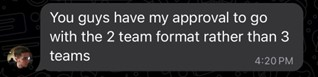
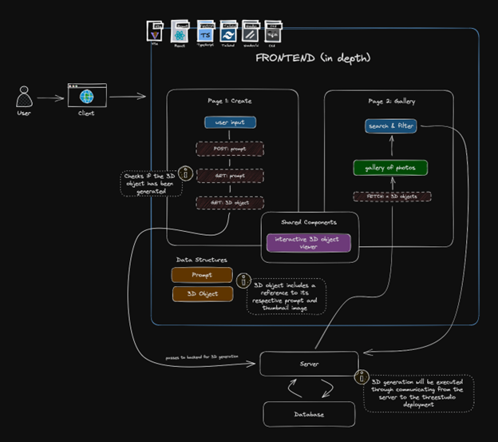

# articulat3 - Team Corndogs
# D2 Team Report

- [Summary of Our Software](#summary-of-our-software)
- [Project Division](#project-division)
    - [Why?](#why)
    - [How?](#how)
- [Sub-team Responsibilities](#sub-team-responsibilities)
    - [Sub-team 1: Frontend](#sub-team-1-frontend)
    - [Sub-team 2: Backend](#sub-team-1-backend)

## Summary of Our Software

  

#### Problem and Partner

Our partner, Toronto Intelligent Systems Lab (TISL), enables robust interactive autonomy in robotics. Their research involves Robotics, Computer Vision, and Machine Learning[^1]. Their goal for this project is to make 3D generation as simple and accessible as possible. Users need 3D objects for content creation (ie. video games, social media, animations, 3D printing), but have difficulty learning existing modeling software. Generating unique and custom 3D objects should be a frictionless experience. It would also be helpful for users to view other 3D creations for further inspiration and usage in their own products. 

#### Product

The product we’ll be creating is a user-friendly web application for 3D content creation from user-given text prompts. Users will also be able to view existing 3D creations for inspiration and creative usage. When entering the site, users will see a clear call-to-action to generate new 3D content. An input text box first prompts them to describe an object. The site then chooses the best model to create the object. At the time of writing, the site will support and choose from Score Jacobian Chaining, DreamFusion, TextMesh, Latent-NeRF, and Fantasia3D[^2]. The web app will then use the exposed Gradio API from threestudio to generate the 3D object and prepare for export. Furthermore, the home page will feature an updating gallery with image thumbnails of previously generated objects. When a thumbnail is clicked, the user can interact with the 3D object using their mouse, with support for object revolution. The gallery will be searchable using the prompts associated with the objects (note that these prompts don’t need to be unique). The user can then download all files associated with an object. In particular, our product will support downloads of the thumbnail (.png), surface material (.mtl), geometry definition (.obj), and textures (.jpg). 

[^1]:https://tisl.cs.toronto.edu/ 
[^2]:https://github.com/threestudio-project/threestudio

#### Existing Software

We will be using the existing threestudio project, which is a unified framework for 3D content creation. Threestudio supports the aforementioned 3D ML models and is implemented in Python. The Python framework allows us to train a model on a text prompt and export the 3D mesh. There are several deployment options that we can access, a HuggingFace deployment, threestudio’s self hosted service, and our partner has mentioned the possibility of using a node GPU, and we will choose the method later on in the project.

## Project Division

### Why

Our team divided the project into 2 sub-teams, defining a frontend team (sub-team 1) and a backend team (sub-team 2). We believed that our personal strengths and experiences resulted in a perfectly even split between frontend and backend teams. Having stronger frontend and backend focused teams allows us to deep-dive into specific user stories, create fully implemented user story features, and maintain strong communication between these main components. For example, we deemed it inefficient to have a third separate database team because the database and backend were tightly connected based on our API design; dividing these components further would create communication gaps and unnecessary overlaps. Additionally, having these 2 teams allow for unified and consistent coding guidelines for both frontend and backend components. We also consulted with our partner, who gave his support for our 2-team split^[3]. For D2, we were able to work together with fluid communication to complete our respective user stories. Looking ahead, we believe that splitting the project in this way will help us work efficiently within the same team divisions for future deliverables.

  

### How
#### Frontend

  

The frontend architecture diagram outlines the units required for the full project. In D2, the frontend team implemented aspects of the “Page 1: Create” section. The main components of this page are the user input component and interactive 3D object viewer component (which is shared with the Gallery page). The exact list of features and use cases are defined in sub-team 1’s report. The Create page will call several API endpoints, first to submit the user’s prompt for generation: “POST: prompt”. It will then call the “GET: prompt” endpoint until it receives confirmation that generation is complete. Then, it retrieves the 3D object and necessary metadata using “GET: 3D object”. These calls are sent to the backend server, which interacts with the database and the ML 3D generation deployment. Secondly, future deliverables will implement aspects of the “Page 2: Gallery” section which includes a gallery of existing objects thumbnails. This page interacts with the server by calling the “FETCH: n 3D objects” endpoint to retrieve images on demand, and sending user-provided search queries to filter the gallery by object prompts. In D2, the frontend team used React, TypeScript, Tailwind CSS, Vite, shadcn/ui, and CVA to develop the Create page with a mock backend.

#### Backend

  

The backend architecture diagram outlines the units required for the full project. In D2, the backend team implemented the backend API to communicate with the Google Cloud Storage for blob store. The GET and POST API endpoints for both prompts and blobs were written. The API endpoints will receive information from the frontend for which 3D image to retrieve or store, and will utilize the written GCS interface to interact with the GCS store. Future deliverables will implement the prompt API endpoints to interface with the future Cloud SQL Postgre database, which will be notified by the frontend which prompts to retrieve and store. Additionally, the inference API and interface to call the threestudio ML deployment to generate 3D content will also be included. In D2, the backend team used Go and Chi to write a RESTful API with OpenAPI 3.0 specifications, to communicate with GCS with Terraform for infrastructure, Bazel + Nix to build the system, and Render.com to deploy the app.

## Sub-team Responsibilities

### Sub-team 1: Frontend

The frontend team is responsible for the user story: “As a content creator, I want to generate a 3D graphic according to a desired description in order to save time and effort in designing and creating it myself.” This user story focuses on being able to create 3D content from a text prompt. In order to accomplish this, we developed the frontend components for a web page to create 3D content with. This web page encompasses an input bar for text prompt, a create button, and a navigation bar, along with the appropriate color scheme, font, and overall UI design, accompanied by a fake backend. To create this, we utilized React Typescript powered by Vite, the Tailwind CSS framework for styling, shadcn/ui for base components, and CVA to define component variants.

### Sub-team 2: Backend

The backend team is responsible for the user story: “As a hardware creator, I want to export and download a 3D graphic as a 3D mesh .obj file in order to use it for 3D printing.” This user story focuses on exporting and downloading a 3D graphic as a 3D mesh .obj, and specifically in our case, having a storage system to store 3D content and letting users access this data. In order to accomplish this, we deployed a Google Cloud Storage bucket and created a RESTful API with POST and GET requests to store and retrieve 3D content data. To deploy the backend application, we built the backend infrastructure with Go and Chi and deployed it with Render.com. To manage the Google Cloud Storage, we utilized Terraform as our Infrastructure as Code (IaC). We utilized OpenAPI 3.0 to design our API and Bazel + Nix to build the system. Altogether, we created an early stage application to allow users to store and retrieve 3D content data.
