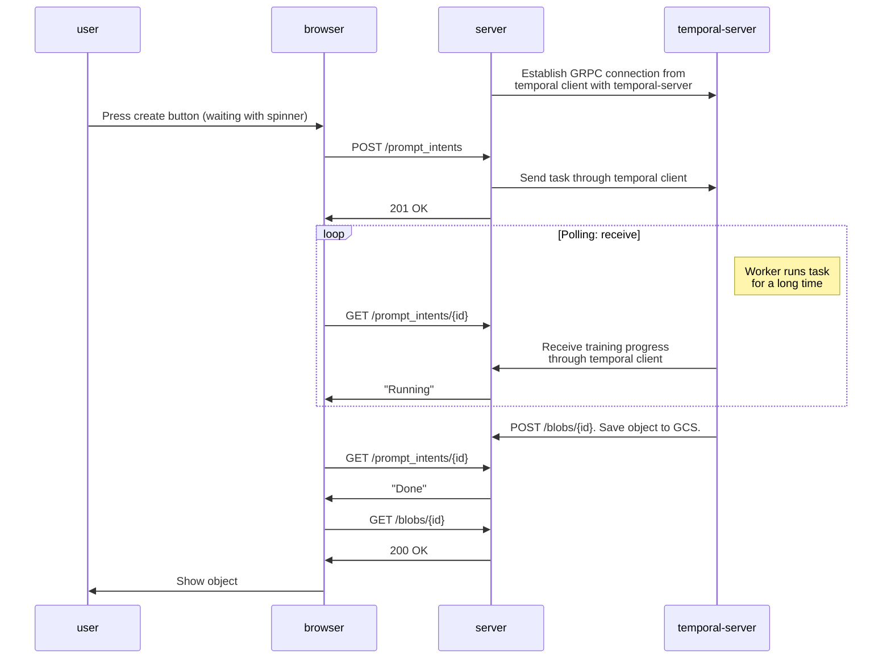
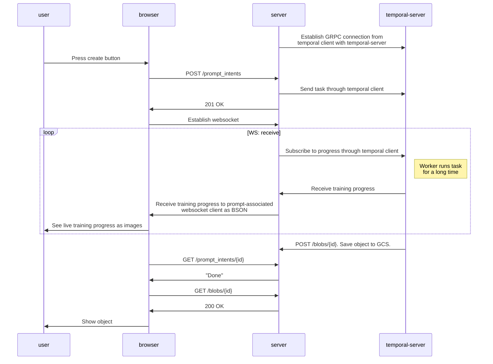

## Current sequence diagram

```mermaid
sequenceDiagram
    participant user
    participant browser
    participant server
    participant temporal-server

    server->>temporal-server: Establish GRPC connection from<br/>temporal client with temporal-server

    user->>browser: Press create button (waiting with spinner)
    browser->>server: POST /prompt_intents
    server->>temporal-server: Send task through temporal client
    server->>browser: 201 OK

    loop Polling: receive
      Note right of temporal-server: Worker runs task<br/>for a long time
      browser->>server: GET /prompt_intents/{id}
      temporal-server->>server: Receive training progress<br/>through temporal client
      server->>browser: "Running"
    end

    temporal-server->>server: POST /blobs/{id}. Save object to GCS.

    browser->>server: GET /prompt_intents/{id}
    server->>browser: "Done"

    browser->>server: GET /blobs/{id}
    server->>browser: 200 OK

    browser->>user: Show object
```

## Goal sequence diagram

```mermaid
sequenceDiagram
    participant user
    participant browser
    participant server
    participant temporal-server

    server->>temporal-server: Establish GRPC connection from<br/>temporal client with temporal-server

    user->>browser: Press create button
    browser->>server: POST /prompt_intents
    server->>temporal-server: Send task through temporal client
    server->>browser: 201 OK

    browser->>server: Establish websocket 

    loop WS: receive
      server->>temporal-server: Subscribe to progress through temporal client
      Note right of temporal-server: Worker runs task<br/>for a long time
      temporal-server->>server: Receive training progress
      server->>browser: Receive training progress to prompt-associated<br/>websocket client as BSON
      browser->>user: See live training progress as images
    end

    temporal-server->>server: POST /blobs/{id}. Save object to GCS.

    browser->>server: GET /prompt_intents/{id}
    server->>browser: "Done"

    browser->>server: GET /blobs/{id}
    server->>browser: 200 OK

    browser->>user: Show object
```
